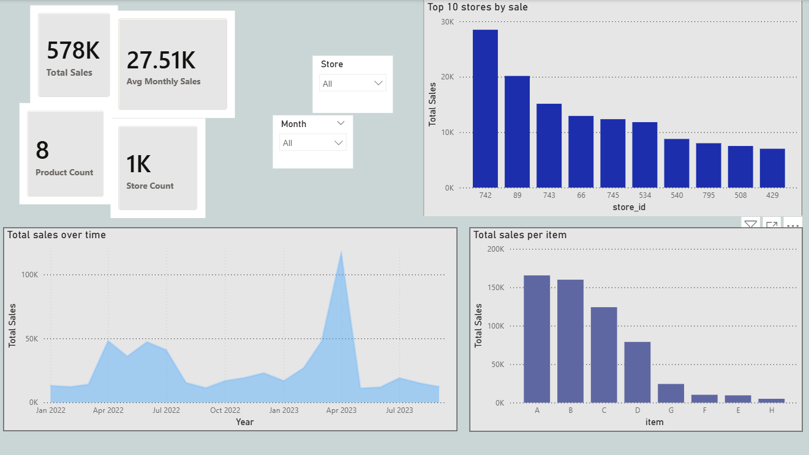

# Retail-KPI-Dashboard
Retail sales KPI dashboard analyzing store performance, product contribution, and sales trends using Python and data visualization.

# Retail KPI Performance Dashboard

## Project Overview
This project analyzes retail sales performance using key performance indicators (KPIs) to monitor store productivity, product contribution, and overall sales trends.

The objective is to build a simple operational dashboard that helps identify top-performing stores, product contributions, and sales patterns over time.

## Key Metrics

- Total Sales: 578K  
- Average Monthly Sales: 27.51K  
- Product Count: 8  
- Store Count: 1000  

## Dashboard Components

### Sales Trend Analysis
Visualizes how sales evolve over time to identify demand patterns and seasonal fluctuations.

### Store Performance
Identifies top-performing stores contributing the most to total sales.

### Product Contribution
Shows revenue distribution across different products.

## Business Questions

1. Which stores generate the highest sales?
2. Which products contribute most to revenue?
3. How do sales evolve over time?

## Dashboard

